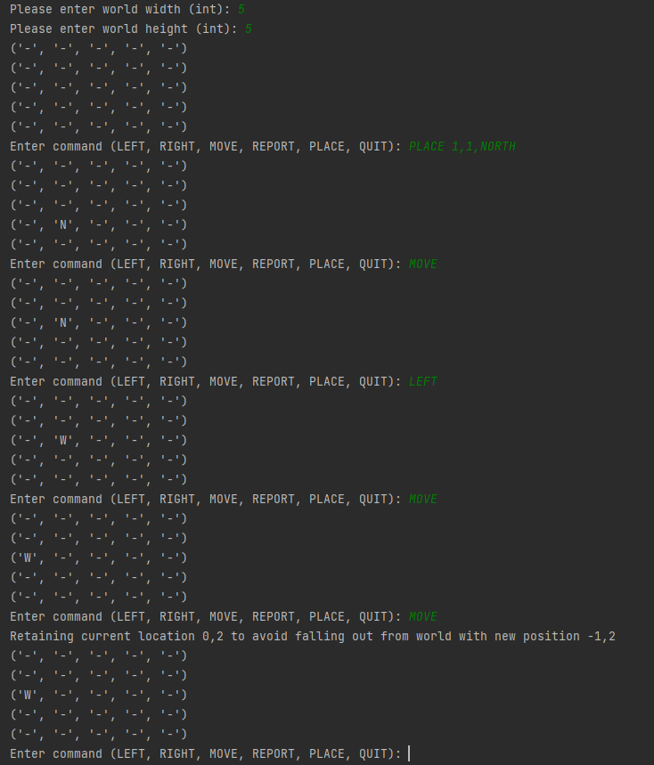
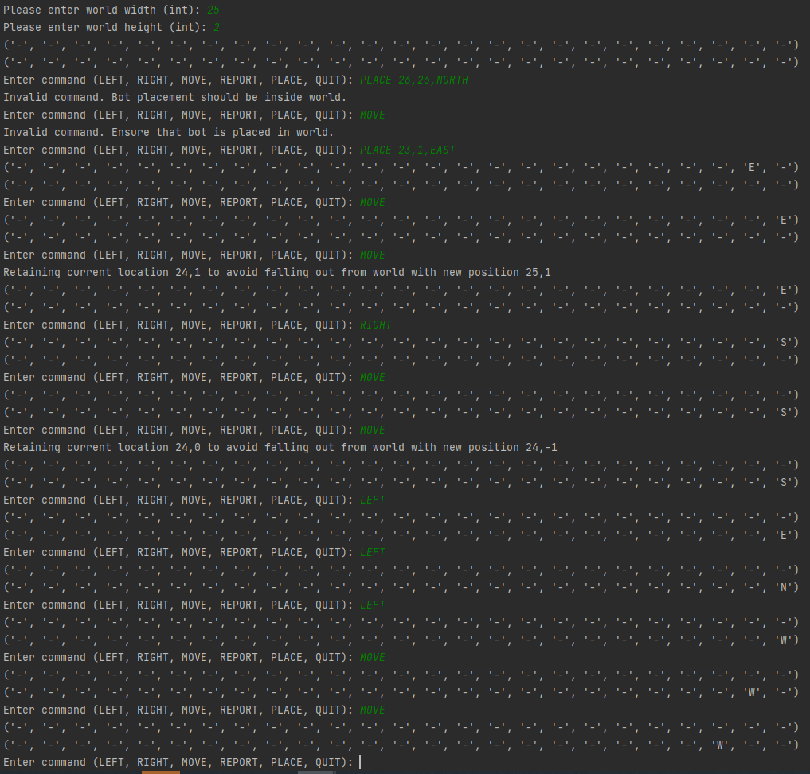
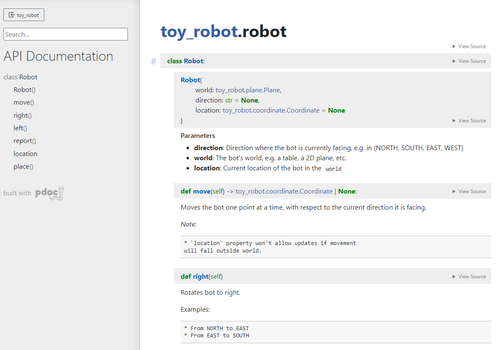

[](https://github.com/psf/black)


<!-- markdown="1" is required for GitHub Pages to render the TOC properly. -->

<details markdown="1">
  <summary>Table of Contents</summary>

- [1 Problem](#s1-problem)
- [2 Installation](#s2-installation)
  * Pre-requisites
- [3 Usage](#s3-usage)
  * Via `Interactive console`
  * Via `pytest` and `txt` files
- [4 Tests](#s4-tests)
  * [Integration tests](s4.1-integration_tests)
  * [Unit tests](s4.2-unit_tests)
- [5 Other Documentations](#s5-other_documentations)
- [6 Contribution Guidelines](#s6-contribution_guidelines)
  * Code Coverage
  * Pre-commit hooks
- [7 Future Improvements](#s7-future_improvements)
- [8 Maintainers](#s8-maintainer)
- [9 Inspiration](#s9-inspiration)

</details>

<a id="s1-problem"></a>
<a id="1-problem"></a>

<a id="problem"></a>
## 1 Problem
### Summary
The application is a simulation of a toy robot moving on a square table-top, of dimensions 5 units x 5 units. There are no
other obstructions on the table surface. The robot is free to roam around the surface of the table, but must be prevented
from falling to destruction. Any movement that would result in the robot falling from the table must be prevented,
however further valid movement commands must still be allowed.

For more details, refer to [Problem Details](docs/md/problem_details.md)

<a id="s2-installation"></a>
<a id="2-installation"></a>

<a id="installation"></a>
## 2 Installation
### 2.1 Pre-requisites
* Working `python3.10` version.
  * **Windows** [Guide](https://docs.python.org/3/using/windows.html)
  * **Linux** (e.g. `ubuntu`) [Guide](https://www.linuxcapable.com/how-to-install-python-3-10-on-ubuntu-22-04-lts/)
* Installed and created a `python` virtual environment
  * **Linux**
    * Installation:
      * Debian / Ubuntu:
        * ```
          sudo apt install python3 python3-dev virtualenv
          ```
      * Fedora:
        * ```
          sudo dnf install python3 python3-devel python3-virtualenv
          ```
      * openSUSE:
        * ```
          sudo zypper install python3 python3-devel python3-virtualenv
          ```
    * Creation:
      * ```
        virtualenv venv
        ```
  * **Windows** (via _pycharm IDE_) [Guide](https://medium.com/@dev.jhesed/how-to-install-and-setup-pycharm-and-venv-in-windows-10-d4af56399b00)

### 2.2 Installation
* The interactive console application doesn't require a third party library to run. Having `python3.10` version should be enough.
* However, if you want to run the `tests`, or add input files or scenarios, or contribute to the source code, you may start with the following steps:

1. Activate `virtualenv`
   * Example (**linux**): `source <path>/venv/bin/activate`
2. If you'll play around with `pytest`, install `requirements/dev.txt`. Otherwise, the project itself doesn't require additional third party library.
   * ```
     pip install -r requirements/dev.txt
     ```

<a id="s3-usage"></a>
<a id="3-usage"></a>

<a id="usage"></a>
## 3 Usage


### 3.1 Via `Interactive console`

#### Command:
    python run.py

#### Example Outputs:
  * **Case: Square world / table**
    * 
  * **Case: Rectangular world / table**
    * 

### 3.2 Via `pytest` and `txt` files.
   1. Place your test scenarios under `tests/test_integration/data`
      * Be sure to follow the correct formatting.
      * You may refer to existing `.txt` files for examples.
   2. Run pytest:
      * Silent:
        * ```
          pytest tests/test_integration/test_integration_via_file.py
          ```
      * Log level == `INFO` :
        * ```
          pytest --log-cli-level=INFO tests/test_integration/test_integration_via_file.py
          ```
   * **Notes:**
     * Currently, all files existing in this directory will be fetched by the unit test and assert if `Output` indicated in the file matches the actual returned value of the runner.
     * Future improvements:
       * Ensure security of these files, by e.g. sanitizing them before processing.
       * Currently, all files run under 1 test. It would be better in the future to segregate them (e.g. `pytest parametrize` style) for more clarity.

<a id="s4-tests"></a>
<a id="4-tests"></a>

<a id="tests"></a>
## 4 Tests
Always code with tests in mind. Folder structure:
```
- tests/
|____ test_integration/
|____ test_unit/
```


<a id="s4.1-integration_tests"></a>
<a id="41-integration_tests"></a>

<a id="integration_tests"></a>
### Integration Tests
* Place all `.txt` files under `test_integration/data/` directory.
  * ` test_integration_via_file.py` will load all files under this directory. It will compare `Output:` field stored in file with actual data generated by `runner`.


<a id="s4.2-unit_tests"></a>
<a id="42-integration_tests"></a>

<a id="integration_tests"></a>
### Unit Tests
* All `classes / methods / functions` should have their own unit tests.
* Aim to test only the functionality of that specific functions and not the whole logic.


<a id="s5-other_documentations"></a>
<a id="5-other_documentations"></a>

<a id="other_documentations"></a>
## 5 Other Documentations

* Auto-generated documentation can be found in `docs/index.html`.
* It is autogenerated based on `docstring` using `pdoc`.

    
* To update the files, run:
    ```
    pdoc ./toy_robot -o ./docs
    ```
* To see docstring updates without rendering `html` files, run:
    ```
    pdoc ./toy_robot
    ```
* Usually, these documents aren't committed in the same repository, but are deployed in a website as part of `CI/CD`.
* For simplicity, and easier usability, these are committed as part of the project.

<a id="s6-contribution_guidelines"></a>
<a id="6-contribution_guidelines"></a>

<a id="contribution_guidelines"></a>
## 6 Contribution Guidelines

* Ensure that `pre-commit` git hooks are installed. These safeguards correct formatting of data, etc. based on a set of rules defined in `.pre-commit-config.yaml`.
* Ensure app's **100% unit** test code coverage. Ideally, the `code coverage badge` will be updated by _CI/CD_. For now, we'll be updating this locally with the following commands:

```
> coverage run --omit="*tests*" -m pytest .
> coverage-badge -o coverage.svg
```

<a id="s7-future_improvements"></a>
<a id="7-future_improvements"></a>

<a id="future_improvements"></a>
## 7 Future Improvements
* Use `loggers` instead of `print` statements.
* Create better `UI`
* Use better dependency management, e.g. `poetry`
* Integrate `CI/CD` related badges, e.g. `build passing` and real-time `coverage`

<a id="s8-maintainer"></a>
<a id="8-maintainer"></a>

<a id="maintainer"></a>
## 8 Maintainer
- Jhesed: _dev.jhesed@gmail.com_

<a id="s9-inspiration"></a>
<a id="9-inspiration"></a>

<a id="inspiration"></a>
## 9 Inspiration
- Thirst for technical knowledge
- My morning and afternoon coffee
- My beautiful wife, Hannah
- Colossians 3:17
